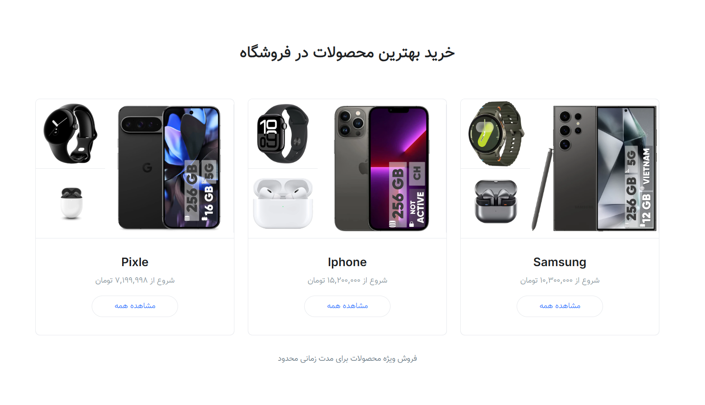
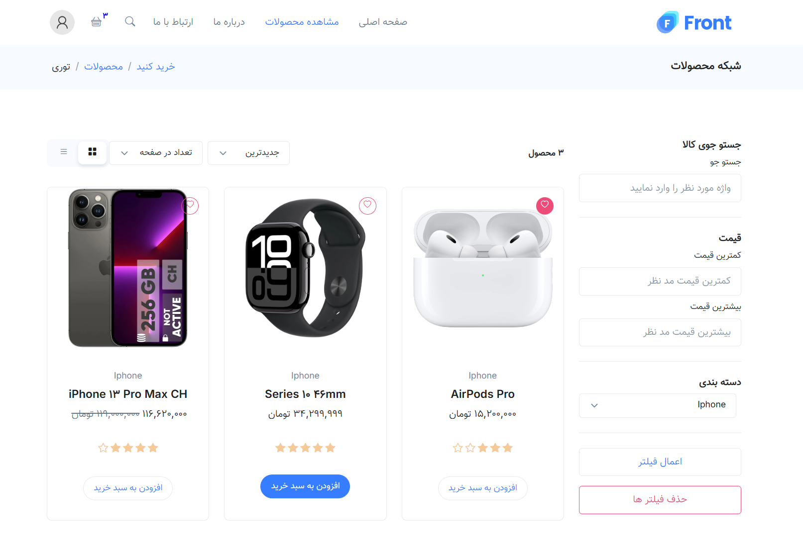
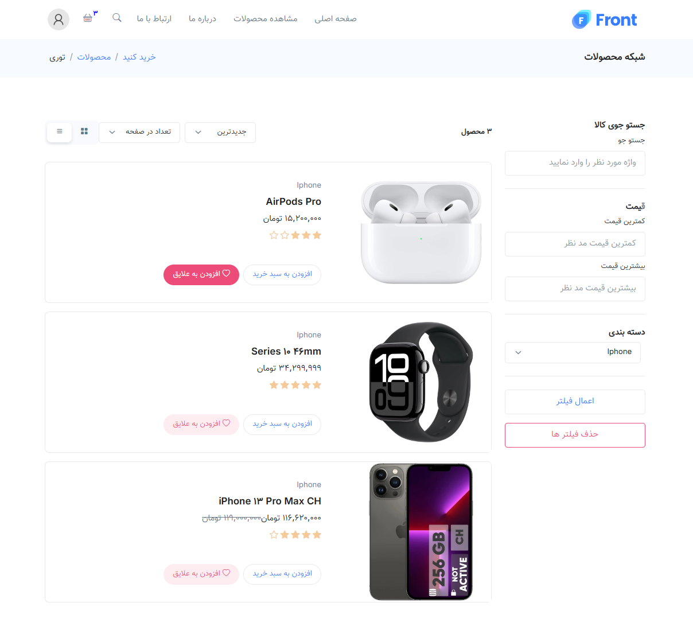
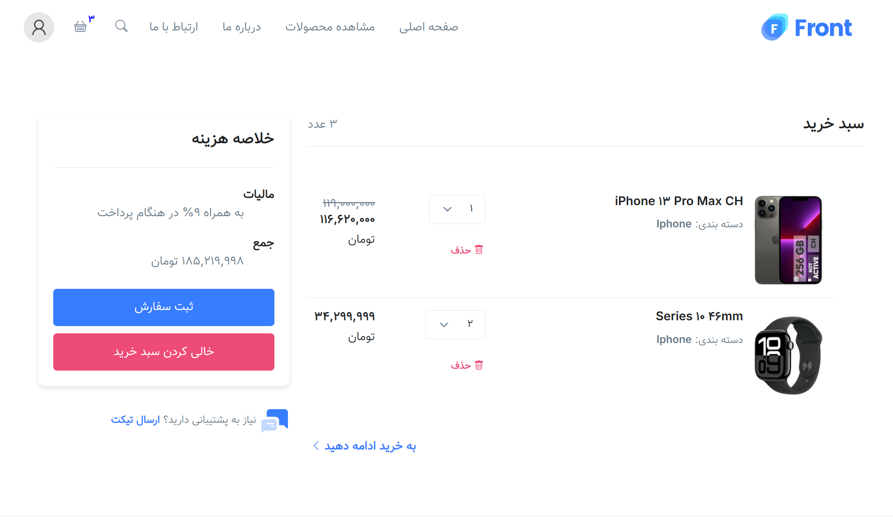
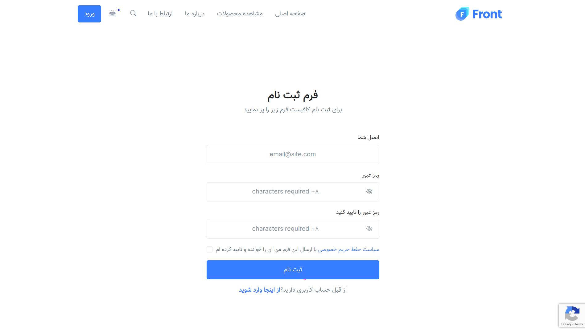
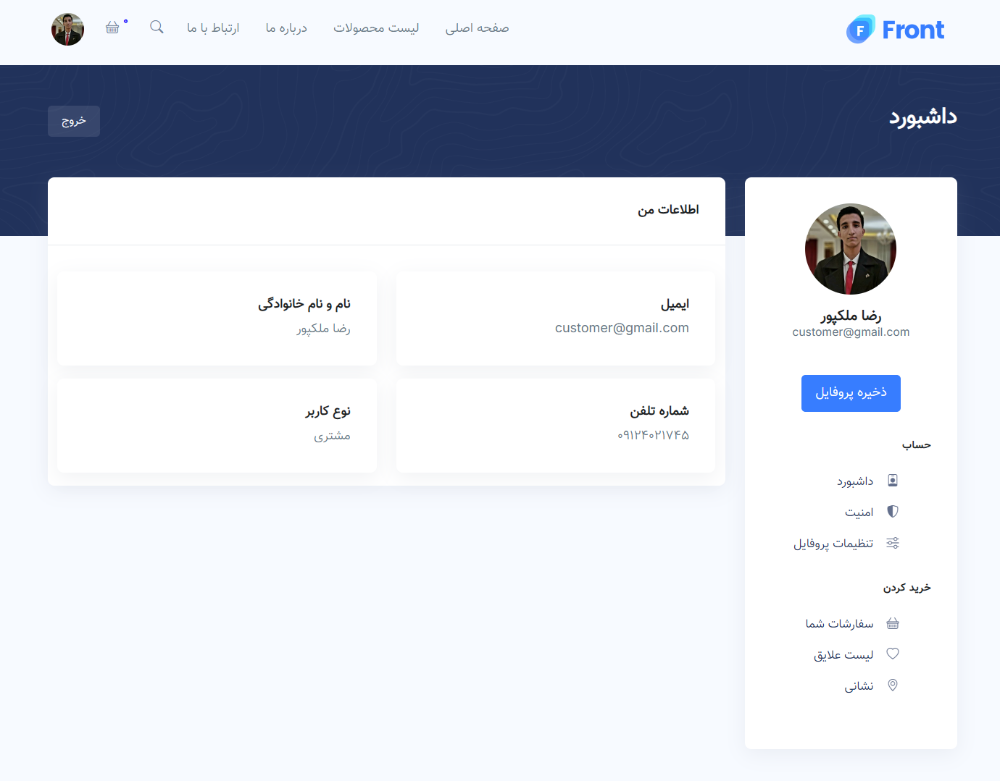
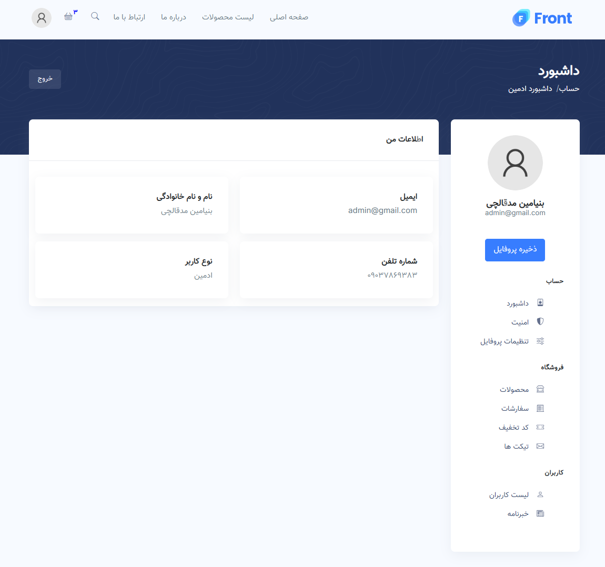
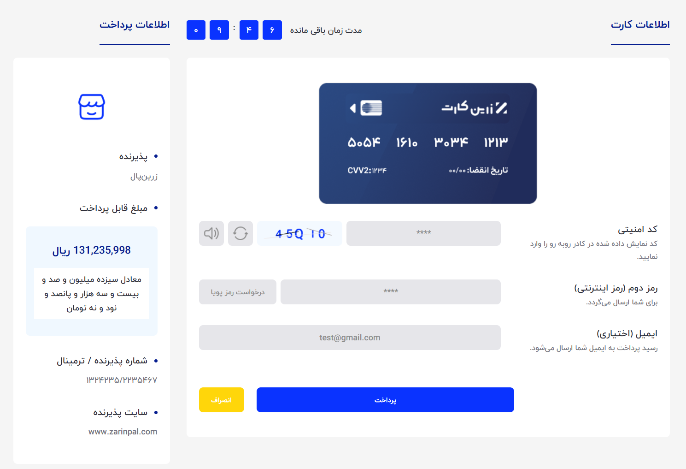
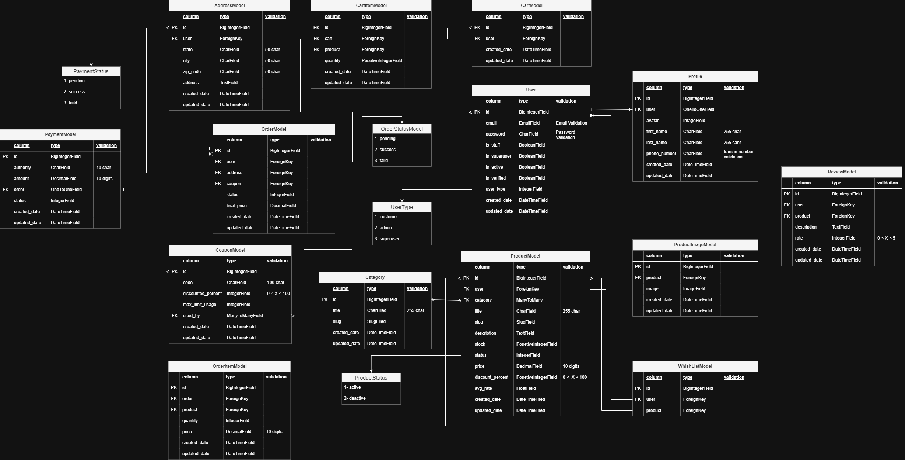

<div align="center">
<h1 align="center">Django Online Shop</h1>
<h3 align="center">It's my biggest peroject that i've ever done, I spent a lot of time on it</h3>
</div>
<p align="center">
<a href="https://www.python.org" target="_blank">  </a>
<a href="https://www.djangoproject.com/" target="_blank" rel="noreferrer">  </a>
<a href="https://www.docker.com/" target="_blank" rel="noreferrer">  </a>
<a href="https://www.postgresql.org" target="_blank" rel="noreferrer">  </a>
<a href="https://developer.mozilla.org/en-US/docs/Web/JavaScript" target="_blank" rel="noreferrer">  </a>
<a href="https://jquery.com/" target="_blank" rel="noreferrer">  </a>
<a href="https://www.w3.org/html/" target="_blank" rel="noreferrer">  </a>
<a href="https://www.w3schools.com/css/" target="_blank" rel="noreferrer">  </a>
<a href="https://redis.io" target="_blank" rel="noreferrer">  </a>
<a href="https://www.gunicorn.org" target="_blank" rel="noreferrer">  </a>
<a href="https://www.nginx.com" target="_blank" rel="noreferrer">  </a>
<a href="https://www.nginx.com" target="_blank" rel="noreferrer">  </a>
<a href="https://min.io/" target="_blank" rel="noreferrer">  </a>
</p>


<hr>

<hr>

<hr>

<hr>

<hr>

# Guideline
- [Goal](#goal)
- [Extera features](#extera-features)
- [Setup](#setup)
    - [First step](#first-step)
    - [Clone it](#clone-it)
    - [Docker](#docker)
        - [Development](#development)
            - [Django Debug Toolbar](#pytest)
            - [Pytest](#django-debug-toolbar)
            - [MinIO Address](#minio-address)
            - [Flake8 and Black](#flake8-and-black)
        - [Deployment](#deployment)
            - [Gunicorn and Nginx](#gunicorn-and-nginx)
- [DB schema](#db-schema)
            


## Goal
I create this website for testing all skills that i've learned

<hr>

# Extera features
I added a lot of useful tools to make this site better, These features include :

### Development & Deployment
I separate all codes and files for use it on [Development](#development) or [Deployment](#deployment)

<hr>

### Caching system
I used redis for caching system in my project

<hr>

### Reformatted code
I reformat all codes depends on PEP8 rule with [Flake8 and Black](#flake8-and-black)

<hr>

### Testing system
I used [Pytest](#pytest) for testing system and test various parts of site

<hr>

### reCAPTCHA V3
I used reCAPTCHA for prevent from robots to enter the site . 

Then why version 3 ?

reCAPTCHA v3 returns a score for each request without user friction. The score is based on interactions with your site and enables you to take an appropriate action for your site. Register reCAPTCHA v3 keys on the reCAPTCHA Admin console.



<hr>

### Documents
I leave a full documention about how the website works in <a href='https://github.com/Benfoxyy/Django-Online-Shop/blob/main/Documents/'>Documents</a> folder

<hr>

### Various User
This shop has 3 types of user :
- <h1>customer</h1>



<hr>

- <h1>admin</h1>



<hr>

- <h1>superuser</h1>

Superuser can remove or add some stuff that admin couldn't

Each of them has a specific profile that has own properties

<hr>

### Sitemap
A sitemap is a file where you provide information about the pages, videos, and other files on your site, and the relationships between them

<hr>

### Payment Method
I used <a href='https://www.zarinpal.com/'>ZarinPal</a> for my Payment Method



<hr>

### MinIO
To me : It's an usful tools for store medias in a safe and accessible place . 

<hr>

# Setup

## First step
For setup this site and walk through it you need to have <a href='https://www.docker.com/'>docker</a> on you computer

## Clone it
Next step is cloning this project
```bash
git clone https://github.com/Benfoxyy/Django-Online-Shop.git
```

## Docker
Docker is a powerful tool for run, deploying and transferring project, so i decided to use it .

As i said i separet my site, so for running it on development or deployment mode, you should follow one of these section :

## Development
```bash
docker-compose up --build -d
```
By running this command everything creat and run automaticlly, after everything is over you can oppen <a href='127.0.0.1:8000'>127.0.0.1:8000</a> on your browser to see the resault

This version of website is for <b>developers</b> to testing and editting

This version has some tools that it is not exist in [Deployment](#deployment) like :

### Django Debug Toolbar
<a href='https://pypi.org/project/django-debug-toolbar/'>django_debug_toolbar</a> is an useful library for django to get reports of every single page and manage it better

<hr>

### Pytest
<a href='https://docs.pytest.org/en/stable/'>pytest</a> is the most powerful testing system for python, for using it enter this command :
```bash
docker-compose exec backend sh -c "pytest"
```

<hr>

### MinIO Address
For seeing all medias that is stored you can visit this url :
```bash
http://127.0.0.1:9001
```
- Username : minioadmin
- Password : minioadmin

<hr>

### Flake8 and Black
As i said <a href='https://pypi.org/project/flake8-django/'>Flake8</a> and <a href='https://pypi.org/project/black/'>Black</a> are helping for reformat all codes by <a href='https://peps.python.org/pep-0008/'>PEP8</a> rule, for using enter this command :
```bash
docker-comopose exec backend sh -c "black . -l 78 && flake8"
```

<hr>

## Deployment
```bash
docker-compose -f docker-compose-deployment.yml up --build -d
```
By running this command everything creat and run automaticlly, after everything is over you can oppen <a href='127.0.0.1'>127.0.0.1</a> on your browser to see the resault

This version of website is for <b>normal user</b> to take a look to site

This version has some tools that it is not exist in [Development](#development) like :

### Gunicorn and Nginx
To set your project to deployment mode, you have to change DEBUG mode to False . This thing is a good way to make your site more secure but there is a disadvantages, statics and medias doesn't serve moreover django can't transfer requests on website so it's the time that <a href='https://gunicorn.org/'>Gunicorn</a> and <a href='https://nginx.org/en/'>Nginx</a> come .

<hr>


# DB schema


<div align="center">
<h1 align="center">Thanks for visiting</h1>
<h3 align="center">I hope that you enjoy it, Let me know if you have any suggestion</h3>
</div>
